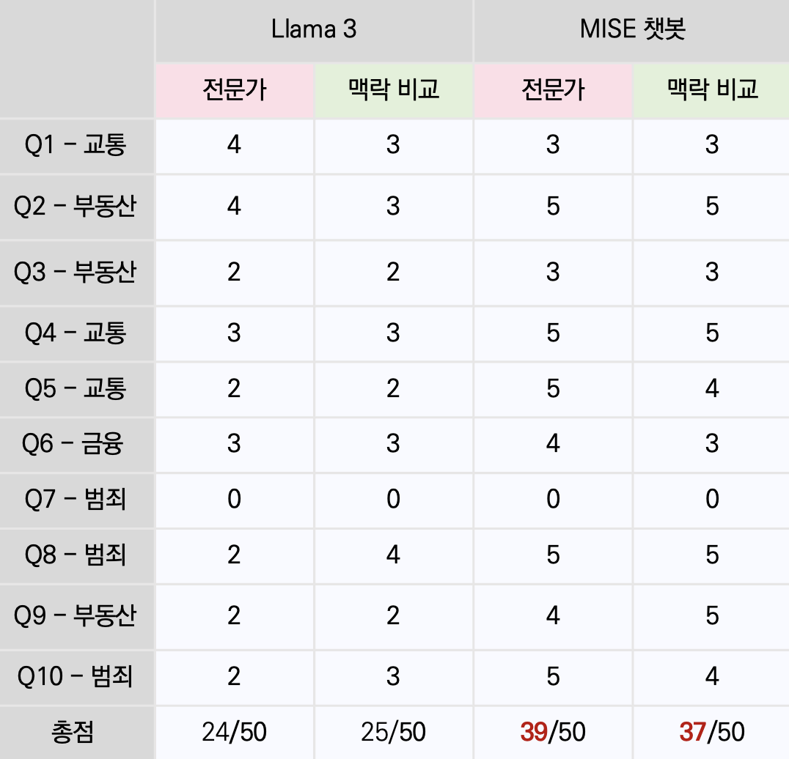

# 2024-1-DCSD-MISE-6

## 프로젝트 소개
<span style="font-size: 20px;"><b>오픈 소스 기반 법률 상담 챗봇</b></span>


<h2>팀 구성</h2>

|                   팀장                    |                     팀원                     |                              팀원                               |                               팀원                                |
| :-----------------------------------------: | :--------------------------------------------: | :-------------------------------------------------------------: | :-------------------------------------------------------------: |
|  |  |  |  |
|     [이철우](https://github.com/lee-cheolwoo)     |     [최성근](https://github.com/seonggeuns)     |           [정유진](https://github.com/y8jinn)            |           [김지안](https://github.com/JianKim3293)            |

## 프로젝트 배경

리걸테크 산업은 성장하고 있음에도 불구하고 일반 사용자들의 법률 서비스 접근성은 떨어지고 있는 상황이다. 
그래서 이러한 문제를 해결하고자 본 프로젝트를 제안합니다.


## 개발 목표

- 사용자 맞춤형 실시간 법률 상담 제공
- 법률 서비스 접근성 개선
- 시간적, 경제적 제약 없이 법률 조언 제공
- 법적 권리 보호 및 법률적 분쟁 예방

## 프로젝트 내용

본 프로젝트는 대화형 챗봇, OCR, RAG 기술을 활용한 차별화된 접근 방식을 제안합니다. 사용자는 텍스트 입력이나 문서 이미지 첨부를 통해 법률 상담을 받을 수 있으며, Fine-tuning 및 RAG 기술을 통해 최신 법률 정보 기반의 맞춤형 상담 결과를 제공합니다. 이를 통해 일반 사용자는 시간적, 금전적 제약 없이 쉽게 법률 서비스를 받을 수 있습니다.

## 최종 결과 설명
  
카카오톡 채널을 통해 구현된 법률 상담 챗봇입니다. 사용자는 법률 관련 이미지나 텍스트를 통해 챗봇에게 질문할 수 있고, 챗봇은 이를 분석하여 적절한 답변을 제공합니다.

## 성능 평가
정성적 평가  
법률 특화 챗봇의 성능 평가를 위해 생활법령정보의 10개 질문을 테스트 질문으로 선정했습니다. 각 질문당 0~5점을 부여했으며, 총점은 50점 만점으로 평가를 진행했습니다. 비교모델은 일반 Llama3 모델과 저희의 MISE 챗봇 모델이며, 각각 법률 전문가 비교, 답안과의 맥락 비교를 시행했습니다.
 

정량적 평가  
Trulens라는 RAG 애플리케이션 평가 프레임워크를 활용했습니다. Trulens에서 지원하는 RAG Triad(Answer Relevance, Context Relevancae, Groundedness) 지표로 평가를 진행했습니다.


## 패키지 버전

이 프로젝트를 실행하기 위해 필요한 패키지는 다음과 같습니다:
- `numpy==1.22.4`
- `pandas==2.0.3`
- `scipy==1.10.1`
- `matplotlib-inline==0.1.7`
- `tensorflow==2.8.2`
- `torch==2.2.2`
- `transformers==4.37.2`
- `flask==3.0.3`
- `requests==2.22.0`
- `google-cloud-vision==3.0.2`
- `peft==0.8.2`

설치하려면 다음 명령어를 사용하세요:
```sh
pip install -r requirements.txt
